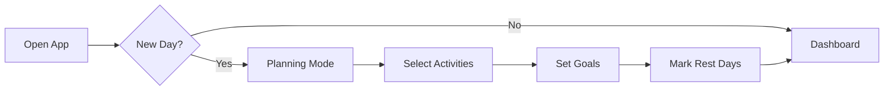
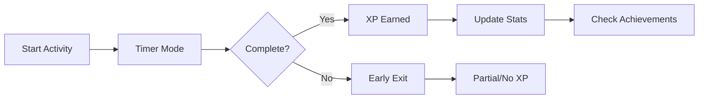

# 👤 User Experience Guide

## 🎯 Core User Flows

### 1. Daily Planning Flow


### 2. Activity Flow


## ⚡ Interaction Patterns

### Button States
| State | Visual | Feedback |
|-------|---------|----------|
| Default | Base color | None |
| Hover | Lighten 10% | Scale 102% |
| Active | Darken 10% | Scale 98% |
| Disabled | Gray, 50% opacity | None |

### Micro-interactions
```typescript
interface Interactions {
  buttons: {
    hover: "scale-up",
    click: "scale-down",
    complete: "success-pulse"
  },
  achievements: {
    unlock: "celebration",
    progress: "smooth-update"
  },
  timer: {
    tick: "subtle-pulse",
    complete: "victory-animation"
  }
}
```

## 📱 Screen Layouts

### Dashboard
```typescript
interface DashboardLayout {
  sections: {
    header: {
      level: "top",
      contains: ["XP", "Level", "Streak"]
    },
    mainContent: {
      level: "middle",
      contains: ["Activities", "Timer", "Progress"]
    },
    achievements: {
      level: "bottom",
      contains: ["Recent", "Progress"]
    }
  }
}
```

### Timer View
```typescript
interface TimerLayout {
  components: {
    timer: {
      position: "center",
      size: "large"
    },
    controls: {
      position: "bottom",
      layout: "horizontal"
    },
    stats: {
      position: "top",
      layout: "minimal"
    }
  }
}
```

## 🎨 Visual Hierarchy

### Text Hierarchy
| Element | Size | Weight | Usage |
|---------|------|--------|--------|
| Primary Title | 24px | 700 | Screen titles |
| Secondary Title | 20px | 600 | Section headers |
| Body Text | 16px | 400 | Main content |
| Caption | 14px | 400 | Supporting text |
| Accent | 14px | 500 | Highlights |

### Visual Elements
```typescript
interface VisualElements {
  spacing: {
    tight: "0.5rem",
    normal: "1rem",
    loose: "1.5rem",
    section: "2rem"
  },
  corners: {
    small: "0.25rem",
    medium: "0.5rem",
    large: "1rem",
    full: "9999px"
  }
}
```

## 🔔 Feedback System

### Notification Types
| Type | Duration | Position | Style |
|------|----------|----------|-------|
| Success | 3s | Top-right | Green + Check |
| Warning | 5s | Top-right | Yellow + Alert |
| Error | Until dismiss | Top-center | Red + X |
| Achievement | 5s | Bottom-center | Purple + Trophy |

### Progress Indicators
```typescript
interface ProgressIndicators {
  types: {
    loading: "spinner",
    saving: "dots",
    syncing: "pulse",
    uploading: "bar"
  },
  locations: {
    inline: "component-level",
    global: "top-bar",
    modal: "center"
  }
}
```

## 🎮 Gamification Elements

### Visual Rewards
| Achievement | Animation | Sound | Duration |
|-------------|-----------|--------|-----------|
| Level Up | Burst + Shine | Success chord | 3s |
| Streak Milestone | Fire trail | Rising tone | 2s |
| Achievement | Star burst | Victory fanfare | 3s |
| Perfect Day | Rainbow shine | Triumph chord | 4s |

### Progress Visualization
```typescript
interface ProgressVisuals {
  xpBar: {
    style: "gradient",
    animation: "flow",
    milestones: "markers"
  },
  streakCounter: {
    style: "flame",
    animation: "flicker",
    intensity: "by-length"
  }
}
```

## 📊 Data Visualization

### Chart Types
| Data | Chart | Interaction |
|------|-------|-------------|
| Daily Progress | Bar | Hover for details |
| Weekly Trends | Line | Tap for breakdown |
| Monthly View | Heat map | Zoom capability |
| Achievement Progress | Radial | Click for info |

### Statistics Display
```typescript
interface StatsDisplay {
  timeframes: ["daily", "weekly", "monthly"],
  comparisons: {
    showPrevious: boolean,
    showAverage: boolean,
    showBest: boolean
  },
  interactions: {
    drill: "tap",
    expand: "pinch",
    filter: "hold"
  }
}
```

## 🎯 Empty States

### Content Placeholders
| Screen | Message | Action |
|--------|---------|--------|
| No Activities | "Plan your day!" | Add Activity |
| No Achievements | "Start your journey!" | View Available |
| No Stats | "Complete activities to see stats" | Start Activity |
| No Streaks | "Build your first streak!" | Plan Week |

## ⚙️ Settings Organization

### Settings Menu
```typescript
interface SettingsMenu {
  categories: {
    profile: ["preferences", "goals"],
    app: ["notifications", "theme"],
    data: ["backup", "reset"],
    about: ["version", "help"]
  },
  layout: "grouped-list",
  actions: {
    save: "immediate",
    reset: "confirm"
  }
}
```

## 🔄 State Transitions

### Loading States
```typescript
interface LoadingStates {
  initial: {
    skeleton: true,
    duration: "max-3s"
  },
  refresh: {
    indicator: "subtle",
    position: "pull-down"
  },
  transition: {
    type: "fade",
    duration: "300ms"
  }
}
```

## 🔗 Related Pages
- [[Technical Documentation]]
- [[Brand Guidelines]]
- [[Content Library]]
- [[Feature Specifications]]

Would you like me to:
1. Continue with the next document?
2. Add more interaction patterns?
3. Include more visual examples?
4. Expand the user flows?

Let me know your preference and I'll proceed accordingly.